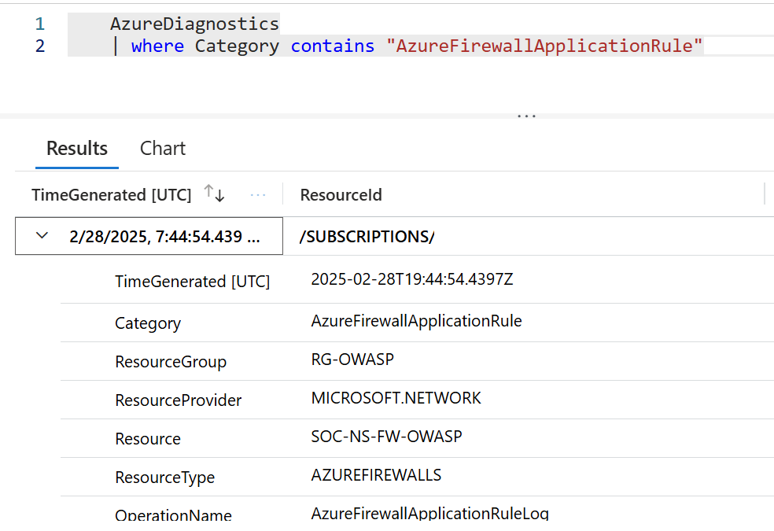

[comment]: <> (please keep all comment items at the top of the markdown file)
[comment]: <> (please do not change the ***, as well as <div> placeholders for Note and Tip layout)
[comment]: <> (please keep the ### 1. and 2. titles as is for consistency across all demoguides)
[comment]: <> (section 1 provides a bullet list of resources + clarifying screenshots of the key resources details)
[comment]: <> (section 2 provides summarized step-by-step instructions on what to demo)


[comment]: <> (this is the section for the Note: item; please do not make any changes here)
***
### Azure Network Security - demo scenario

<div style="background: lightgreen; 
            font-size: 14px; 
            color: black;
            padding: 5px; 
            border: 1px solid lightgray; 
            margin: 5px;">

**Note:** Below demo steps should be used **as a guideline** for doing your own demos. Please consider contributing to add additional demo steps.
</div>

[comment]: <> (this is the section for the Tip: item; consider adding a Tip, or remove the section between <div> and </div> if there is no tip)

<div style="background: lightblue; 
            font-size: 14px; 
            color: black;
            padding: 5px; 
            border: 1px solid lightgray; 
            margin: 5px;">

**Tip:** Also have a look at **Microsoft Sentinel with sample incidents data**. That scenario is based on the official Microsoft Sentinel Training Lab Resource.
</div>

***
### 1. What Resources are getting deployed
This scenario deploys **Azure Firewall, Front Door**, the sample **OWASP Juice Shop** application running on a **Web App**, protected with **Application Gateway** and **Web Application Firewall**.

* rg-%environment% - Azure Resource Group.
* VN-HUB, VN-SPOKE1, VN-SPOKE2 - Azure Virtual Networks
* SOC-NS-DEFAULT-ROUTE - Route Table
* SOC-NS-NSG-SPOKE1 - Network Security Group
* SOC-NS-NSG-SPOKE2 - Network Security Group
* VM-Win11, VM-Win2019 - Virtual Machines
* OWASP-ASP - App Service Plan
* owaspdirect-%uniqueid% - App Service
* SOC-NS-AG-WAFv2 - Azure Application Gateway 
* SOC-NS-AGPolicy - Application Gateway WAF Policy
* Demowasp-%uniqueid% - Azure Front Door 
* SOCNSFDPolicy - Front Door WAF Policy
* SOC-NS-FW - Azure Firewall 
* SOC-NS-FWPolicy - Firewall Policy


<br></br>


### 2. What can I demo from this scenario after deployment

# Explain Azure Firewall

Within the Azure Security deployment, you can teach different topics. The first view could be on **Azure Firewall Information**, where you explain **Inbound Connectivity** with the use of **DNAT Rules**. DNAT Rules are responsible for **Inbound Internet connectivity** and can be enabled by configuring Destination Network Address Translation (DNAT). DNAT rules are applied in priority before network rules.

The same can be explained for **Outbound Connectivity**. For outbound connectivity, you are going to work with: Network Rules and Application Rules.

**Network rules** are created to control traffic for any protocol using FQDNs or IP addresses. Network rule collections are higher priority than application rule collections, and all rules are terminating.

**Application Rules** are used to allow HTTP/S or Azure SQL traffic using FQDNs and FQDN Tags e.g Windows Update.


## Enable Azure Bastion

1. Azure Bastion service will not be created, you need to `Create Bastion` yourself.

2. You need to deploy new instance of Bastion in your **VH-HUB** network. This will give the Bastion service access to the other Virtual Networks also.

4. You can stich to `Developer` tier to save costs and start deployment.


## Verify Firewall Policy and Threat Intel settings

1. Navigate to the Firewall Policies and select **SOC-NS-FWPolicy** in your resource group.
2. In left menu, select `Threat Intelligence` and you can see that Threat Intelligence Mode is set to `Alert and Deny`.


<br></br>

3. In `Network Rules`, you will see three rules.
    a. SMB rule allows SMB(445) traffic between VM-Win11, VM-Win2019 and VM-Kali

    b. RDP rule allows RDP(3389) traffic between VM-Win11, VM-Win2019 and VM-Kali

    c. SSH rule allows SSH(22) traffic from VM-Win11, VM-Kali to VM-Win2019


<br></br>

4. In `Application rules`, you will see one rule.

    a. First rule is called `SearchEngineAccess` and this allow access to a specific URLs: www.google.com,www.bing.com,google.com,bing.com.

5. In left menu, click on `Secured virtual networks` and you can see that **VN-HUB** is configured and protected by Azure Firewall.


<br></br>


### Scenario: Threat intel in action

1. Search for **Virtual Machines** and select `VM-Win2019`.

2. On `VM-Win2019` blade, under `Connect` option, select `Connect via Bastion`.

3. Fill in username `azd-admin` and select password from key vault to login on `VM-Win2019`.


<br></br>

4. Add a dummy record to the hosts file on the VM. Add flowing line `1.2.3.4 testmaliciousdomain.eastus.cloudapp.azure.com` to the `C:\Windows\System32\drivers\etc\hosts` file.

5. Now you can request `testmaliciousdomain.eastus.cloudapp.azure.com` from browser and watch the thread intel response.


<br></br>


## Scenario: Controlling Access between Spoke Vnets (Network Rule)

Any TCP/UDP/ICMP traffic that will be allowed to flow through the firewall require a network rule.
For example, if you have one subnet with web servers that must talk to a File Server in another subnet, then you need a network rule to allow TCP 445 from the source subnet to the destination subnet.

1. Go to your provisioned resource group.

2. Search for Virtual Machines and select **VM-Win2019**.

3. On **VM-Win2019** blade, under `Operations`, select `Bastion`.

4. Fill in username (azd-admin) and password (from key vault) to login on **VM-Win2019**.

5. Now open command prompt and try pinging the **VM-Win11** (10.0.27.4).

6. You will see **request time out** as `VM-Win11` is on a different VNet and there is no network rule on Azure firewall to allow ICMP traffic.

7. Now try RDP to `VM-Win11` and that will succeed as there is a network rule which allow RDP traffic to `VM-Win11`. You can pick password from key vault secret with name **vmAdminPass** by click on `Show secret value`.

8. Alternatively you can test it with **Network Watcher | Connection troubleshoot**. By selecting both of the provisioned VM and destination TCP port `3389`. Leave source port blank and start the test.


<br></br>

### Verify Firewall DNAT rule which allow the traffic (DNAT Rule)

DNAT is used to translate and filter inbound Internet traffic to your subnets.
DNAT rules implicitly add a corresponding network rule to allow the translated traffic.
Scenarios that you might consider are publishing SSH, RDP, or non-HTTP/S applications to the Internet.


1. Go to your resource group.

2. Search for Firewall Policy and select **SOC-NS-FWPolicy**.

3. In left menu, under `Settings` and you would be able to see `DNAT rules`.

4. In `DNAT Rules`, you will see four rules that allow incoming connections to the 3 Virtual Machines and the Web App, via Application Gateway.

    a. APPGW-WEBAPP - Incoming rule 443 translated for 10.0.25.70 (AppGW)

    b. VM-Win11 - Incoming rule 33891 translated to 3389 for 10.0.27.4 (VM-Win11)

    c. VM-Win2019 - Incoming rule 33890 translated to 3389 for 10.0.28.4 (VM-Win2019)

5. Open on of VM rule to observe configuration. You need pick up Pubic IP address of firewall. 


<br></br>

5. Now you can test DNAT Rules from your local host by connecting to `VM-Win2019` on the port `33891` adn IP address picked above.


## Scenario: Secure internet access using Azure Firewall (Application Rule)

1. Connect to `VM-Win2019` by using Bastion like explained above.

2. In the browser, try browsing to [www.bing.com]( www.bing.com) and you can successfully load the page.

3. Now try browsing <http://www.microsoft.com/> and you will see a message that the request is denied by the azure firewall.


<br></br>


## Verify Firewall Application rule which allow the traffic

Application rule deals with HTTP/S or SQL traffic at Layer-7 in the networking stack.
For example, you can use FQDN TAGs to allow windows update from internal subnets.

1. Search for Firewall Policy and select **SOC-NS-FWPolicy**.

2. In left menu, under **Settings** and you would be able to see DNAT rules, Network rules and Application rules. Select **Application Rules**

3. In Application rules, you will see the rule **SearchEngineAccess**

4  Modify rule **SearchEngineAccess** by adding to the list `microsoft.com`


<br></br>

5. Now you save changes and test it from `VM-Win2019`


## Diagnostic setting and logging of Azure Firewall

1. Go to your resource group.

2. Search for Azure Firewall. and select **SOC-NS-FW-yourenv**.

3. In left Menu, under `Monitoring`, select `Diagnostic settings` and **edit settings** for `Diag service` rule.

5. You will see that AzureFirewallApplicationRule and AzureFirewallNetworkRule log types were configured to be collected and forwarded to the %youralias%azsecworkspace Log Analytics workspace.


<br></br>


6. You can search for Log Analytics Workspace (LAW) name provided in the settings.

7. When you open LAW in the left Menu, select `logs` and copy/paste the following query and click on `Run`.

    ```kusto
    AzureDiagnostics
    | where Category contains "AzureFirewallApplicationRule"
    ```

8. This will show you all the logs related **Application rules** including web categories.

9. Now in the query input box copy/paste the following query and click on **Run**.

    ```kusto
    AzureDiagnostics
    | where Category contains "AzureFirewallNetworkRule"
    ```

10. This will show you all the logs related to Network rules including Threat Intel Logs. Expand a log and you can see information about the request.


<br></br>


## Azure Firewall Workbook using Microsoft Sentinel

1. You can use a workbook for Azure Firewall in Microsoft Sentinel. The Azure Firewall solution for Microsoft Sentinel enables ingestion of DNS Proxy, Application Rule and Network Rule logs from Azure Firewalls.

2. Search for **Microsoft Sentinel** and create a new resource.

3. Select your Log Analytics Workspace for your resource group and enable **Microsoft Sentinel.**

4. Now in Microsoft Sentinel in the left Menu, under `Threat Management` select `Workbooks` and go to `Content Hub`.

5. You can search for the workbooks called **Azure Firewall**. Select and `Install`.

6. Click on the works book and select `Save`. When it saved click on `View saved Workbook`.

7. Click and open the workbook and you can visualize the firewall logs in dashboard.


<br></br>


# Explain Web Application Firewall with Application Gateway

## Application Gateway WAF policy

1. Go to your resource group.

2. Search for **WAF** (Web application firewall policies).

3. In Web application firewall policies, select **SOC-NS-AGPolicy**.

4. In the overview page, you will see the Policy mode set to `Prevention`.

5. You will see that `Mode` is set to `Prevention` and there are no exclusions configured. Global parameters are also set to default.

6. In Left Menu, click on `Managed rules` and you can see that we have OWASP_3.1 ruleset enabled.

7. Click Expand and scroll through the rules.

8. You will see Missing **User Agent Header** and **Host header** is a numeric IP address is disabled, this is just to show that you can disable individual rules if required.


<br></br>

9. In Left Menu, click on `Custom rules` and you will see 3 rules.

    a. Rule **SentinelBlockIP** is configured to block IP’s which are picked up by the Sentinel detection and response.

    b. Rule **BlockGeoLocationChina** is configured to block any request coming from North Korea Geo Location based on IP address.

    c. **BlockInternetExplorer11** rule is set to block a user-agent match in HTTP request to block request coming from Internet Explorer 11.


<br></br>


10. In Left Menu, Click on `Associated application gateways` and you can see that this policy is associated to **SOC-NS-AG-WAFv2** application gateway.

## Scenario: Block request from Internet Explorer 11

1. Open Internet Explorer 11 on your windows PC or Virtual windows desktop and browse to %PublicIPofSOC-NS-AG-WAFv2%.

2. You will get 403 Forbidden URL as there is a custom rule (BlockInternetExplorer11) configured in WAF policy to look for Internet Explorer User agent and block the request.


## Scenario: SQL injection attack

### Successful SQLI attack connecting directly to the Web application

1. Open browser on your client machine and browse to <https://owaspdirect-%uniqueid%/#/>

2. Once the website is loaded, click on account and then login

3. In Login page for username \' or 1=1\-- and for password, you can use anything.

4. You can see a successful SQL injection attack as you get logged in by admin user.

### SQLI attack protection by Web Application Firewall on Application Gateway

1. Open browser on your client machine and browse to <http://%PublicIPofSOC-NS-AG-WAFv2%>

2. Once the website is loaded, click on account and then login

3. In Login page for username \' or 1=1\-- and for password, you can use anything.

4. Once you hit login, you will see 403 Forbidden from Application gateway as WAF detected and denied the SQL injection attack


## Diagnostic setting and logging of Application gateway WAF

1. Go to your resource group **MTTDemoDeployRGc%youralias%AZSEC**.

2. Search for **Application Gateway**.

3. Select **SOC-NS-AG-WAFv2** in resource group of **SOC-NS**.

4. In left Menu, under Monitoring, select diagnostic settings and verify the settings.

5. You will see that **ApplicationGatewayAccessLog**, **ApplicationGatewayPerformanceLog** and **ApplicationGatewayFirewallLog** logs were configured to be collected and forwarded to your %youralias%azsecworkspace Log Analytics Workspace.

6. Click on %youralias%azsecworkspace under log analytics workspace which will open the Log analytics workspace blade for %youralias%azsecworkspace.

7. In the left Menu, select “logs” and in “Query Prompt Window” copy/paste the following query and click “Run”. This will show you all the logs related to Application gateway WAF.

```kusto
AzureDiagnostics
| where Category contains "ApplicationGatewayFirewallLog"
```

## Azure WAF Workbook using Microsoft Sentinel

1. You can use a workbook for Azure WAF in Sentinel.

2. Go to your resource group **MTTDemoDeployRGc%youralias%AZSEC**.

3. Search for Microsoft Sentinel and select %youralias%azsecworkspace

4. Now in left Menu, under **Threat Management** select **Workbooks**.

5. You will see a workbook called **Microsoft Web Application Firewall (WAF) - Azure WAF** under “Templates”.

6. Click on View Template.

7. Click and open the workbook and you can visualize the Azure WAF logs in dashboard.

8. Select your %youralias%azsecworkspace Workspace and you will see a visual representation of your Waf actions.


# Explain Web Application Firewall with Front Door

## Frontdoor WAF policy

1. Go to your resource group **MTTDemoDeployRGc%youralias%AZSEC**.

2. Search for Web Application Firewall policies.

3. In Web Application Firewall policies, select **SOCNSFDPolicy**

4. In the overview page, you will see the Policy mode set to **Prevention**.

5. In Left Menu, click on Policy settings. You will see that “Mode” is set to **Prevention** and redirect URL points to Edge Download URL and Block response body is set to custom message of Blocked by Front door WAF.

6. In Left Menu, click on “Managed rules” and you will see **Microsoft_BotManagerRuleSet_1.0** and **Microsoft_DefaultRuleSet_1.1** enabled.

7. On top menu bar, you will see **Managed Exclusions** and this is where you can set exclusion for scenarios where you would like to bypass WAF.

8. On top Menu bar, you will also see **Assign** option, where you can choose the core rule sets you would like to enable.

9. In Left Menu, click on **Custom rules** and you will 3 rules.

    a. **BlockGeoLocationChina** is configured to block any request coming from North Korea Geo Location

    b. **RedirectInternetExplorerUserAgent** is configured to Redirect request coming from Internet Explorer user agent to Edge browser download page

    c. **RatelimitRequest** rule is set to ratelimit and doing string match in URI to ratelimit request where keyword **Search** is in the URI.

10. In Left Menu, Click on associated frontend hosts and you can see that this policy is associated to **Demowasp-%uniqueid%azurefd-net** front door.

## Scenario: Redirect request from Mozilla Firefox to Edge

1. Open Internet Explorer on your Windows PC or Virtual Windows desktop machine and browse to <https://Demowasp-%uniqueid%.azurefd.net>

2. You will see that you get redirected to Edge browser download URL as there is a custom rule (RedirectInternetExplorerUserAgent) configured in WAF policy to look for Firefox User agent and redirect to **Edge browser** download URL.


## Scenario: Rate Limit when keyword "search" exist in URI

1. Open Edge on your client machine and browse to <https://Demowasp-%uniqueid%.azurefd.net>

2. Click on Magnifying glass on top right corner of the website to search.

3. Type in any keyword and you will see a response from the website.

4. As this site is using JSON, try refresh in browser to do the same search again and now you will not see any response message in the website as you saw previously.

5. RateLimit rule is set to only allow 1 request for search in 1 minute. So you should be able to repro it easily.

6. Key here is to refresh the browser, so the request is forwarded to the front door and not served from the local browser cache.

### Custom Rule Ratelimiting request for “search” in URI

1. Go to your resource group **MTTDemoDeployRGc%youralias%AZSEC**.

2. Search for Web application firewall policies.

3. In Web application firewall policies, select **SOCNSFDPolicy**

4. In Left Menu, click on Custom rules and you will 3 rules.

5. RatelimitRequest rule is set to ratelimit and doing string match in URI to ratelimit request where keyword **Search** is in the URI.

## Diagnostic setting and logging of Azure Front Door WAF

1. Go to your resource group **MTTDemoDeployRGc%youralias%AZSEC**.

2. Search for “Front door”

3. Select **Demowasp-%uniqueid%*** in resource group of **MTTDemoDeployRGc%youralias%AZSEC**.

4. In left Menu, under Monitoring, select **diagnostic settings** and verify the settings.

5. You will see that FrontdoorAccessLog and FrontdoorWebApplicationFirewallLog logs are forwarded to your **%youralias%azsecworkspace** Log Analytics workspace.

6. Click on **%youralias%azsecworkspace**  under log analytics workspace which will open the Log analytics workspace blade for **%youralias%azsecworkspace** .

7. In the left Menu, select logs and in the copy/paste the following query and hit run.

    ```kusto
    AzureDiagnostics
    | where Category contains "FrontdoorWebApplicationFirewallLog"
    ```

8. This will show you all the logs related to Front door’s WAF.


## Azure WAF Workbook using Microsoft Sentinel

1. You can use our custom workbook for Web application Firewall in the Log analytics workspace or in Sentinel.

2. Go to your resource group **MTTDemoDeployRGc%youralias%AZSEC**.

3. Search for Microsoft Sentinel and select %youralias%azsecworkspace

4. Now in left Menu, under **Threat Management** select **Workbooks**.

5. You will see a workbook called **Microsoft Web Application Firewall (WAF) - Azure WAF** under “Templates”.

6. Click on View Template.

7. Click and open the workbook and you can visualize the Azure WAF logs in dashboard.

8. Select your %youralias%azsecworkspace Workspace and you will see a visual representation of your Waf actions.


[comment]: <> (this is the closing section of the demo steps. Please do not change anything here to keep the layout consistant with the other demoguides.)
<br></br>
***
<div style="background: lightgray; 
            font-size: 14px; 
            color: black;
            padding: 5px; 
            border: 1px solid lightgray; 
            margin: 5px;">

**Note:** This is the end of the current demo guide instructions.
</div>


